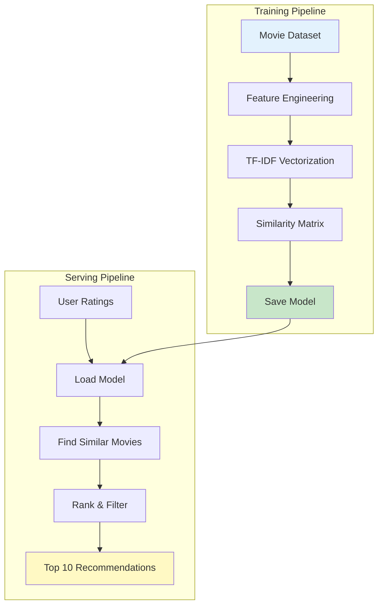
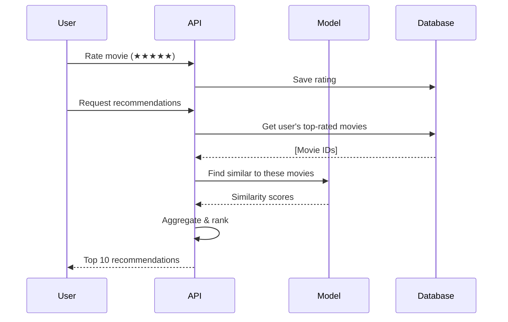
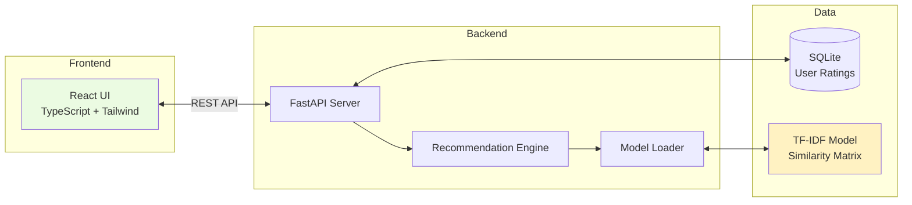

# 🎬 Smart Movie Recommender

> A content-based movie recommendation system using machine learning. Rate movies and get personalized suggestions based on your taste.

[](https://www.python.org/downloads/)
[](https://scikit-learn.org/)
[](https://fastapi.tiangolo.com/)
[](https://reactjs.org/)
[](https://www.docker.com/)
[](LICENSE)

## 🎯 What I learned with this project:

- ✅ **Classical ML**: Content-based filtering with TF-IDF and cosine similarity
- ✅ **ML Pipeline**: Separate training and serving architecture
- ✅ **Feature Engineering**: Creating meaningful features from movie metadata
- ✅ **Model Deployment**: Serving predictions via REST API
- ✅ **Full-Stack Skills**: React frontend with TypeScript + Python backend
- ✅ **Production Practices**: Model versioning, evaluation metrics, Docker deployment

## 🌟 Key Features


### User Features
- 🔍 **Browse Movies**: Explore 1,000+ movies across all genres
- ⭐ **Rate & Review**: 5-star rating system with personal history
- 🎯 **Smart Recommendations**: Get 10 personalized movie suggestions
- 📊 **Explanation**: See why each movie is recommended
- 🔎 **Search & Filter**: Find movies by title, genre, or year
- 📈 **Similar Movies**: Discover movies like your favorites

## 🚀 Quick Start

### Prerequisites

- Docker & Docker Compose installed
- (Optional) Node.js 18+ for local frontend development

### One-Command Setup
```bash
# Clone and start
git clone https://github.com/yourusername/smart-movie-recommender.git
cd smart-movie-recommender

# Copy environment file
cp .env.example .env

# Start everything with Docker
docker-compose up -d

# Initialize database and train model (first time only)
docker-compose exec backend python scripts/download_dataset.py
docker-compose exec backend python training/train.py

# Open in browser
open http://localhost:3000
```

**That's it!** 🎉 You now have a working movie recommender.

### Production Deployment

For production deployment, use the production Docker Compose configuration:

```bash
# Build and start production services
docker-compose -f docker-compose.prod.yml up -d

# Or use the setup script
./setup.sh
```

**Production Features:**
- Optimized builds with multi-stage Dockerfiles
- Nginx for frontend static file serving
- Read-only model volumes
- Automatic restarts on failure
- Environment variable configuration

**Environment Variables for Production:**
```bash
# .env.prod
DATABASE_URL=sqlite:///./data/movies.db
MODEL_PATH=/app/models/
CORS_ORIGINS=https://yourdomain.com
API_URL=https://api.yourdomain.com
```

## 🎬 How It Works

### The Algorithm

This project uses **content-based filtering**:

1. **Feature Extraction**: Combine movie genres, cast, director, and plot keywords
2. **Vectorization**: Convert text features into numerical vectors using TF-IDF
3. **Similarity Calculation**: Compute cosine similarity between all movies
4. **Recommendation**: Find movies most similar to ones you've rated highly


### Why Content-Based?

✅ **No Cold Start**: Works even for new users  
✅ **Explainable**: Can show why movies are recommended  
✅ **Privacy-Friendly**: Doesn't need data from other users  
✅ **Beginner-Friendly**: Clear, interpretable algorithm  

## 📊 Architecture


## 🛠️ Tech Stack

### Backend
- **Python 3.11**: Core language
- **FastAPI**: REST API framework
- **scikit-learn**: ML library (TF-IDF, cosine similarity)
- **Pandas**: Data manipulation
- **SQLAlchemy**: Database ORM
- **Pydantic**: Data validation

### Frontend
- **React**: UI library
- **TypeScript**: Type safety
- **Tailwind CSS**: Styling
- **Shadcn UI**: Component library
- **React Query**: Data fetching
- **Recharts**: Visualizations
- **Vite**: Build tool

### ML Pipeline
- **Training**: Offline Python scripts
- **Serving**: Loaded models in API
- **Storage**: Pickled models + metadata

## 📁 Project Structure
```
smart-movie-recommender/
├── training/
│   ├── train.py              # Main training script
│   ├── data/
│   │   └── movies.csv        # MovieLens dataset
│   ├── models/
│   │   ├── similarity_matrix.pkl
│   │   ├── tfidf_vectorizer.pkl
│   │   └── metadata.json     # Model performance metrics
│   └── notebooks/
│       └── exploration.ipynb # Data analysis
│
├── backend/
│   ├── app/
│   │   ├── api/              # API endpoints
│   │   │   ├── movies.py
│   │   │   ├── ratings.py
│   │   │   └── recommendations.py
│   │   ├── core/
│   │   │   ├── recommender.py     # Recommendation logic
│   │   │   └── model_loader.py    # Load trained models
│   │   └── db/               # Database models
│   └── tests/                # Backend tests
│
├── frontend/
│   ├── src/
│   │   ├── components/       # React components
│   │   ├── pages/            # Page components
│   │   └── lib/              # API client
│   └── public/
│
└── docker-compose.yml
```

## 💻 Local Development

### Training the Model
```bash
cd training

# Install dependencies
pip install -r requirements.txt

# Download MovieLens dataset
python scripts/download_dataset.py

# Train the model
python train.py --data data/movies.csv --output models/

# Output:
# Loading 1000 movies...
# Creating features from genres, cast, directors...
# Computing TF-IDF vectors...
# Calculating similarity matrix (1000x1000)...
# Saving models...
# ✓ Model saved to models/similarity_matrix.pkl
# 
# Evaluation Metrics:
# - Coverage: 87% of movies recommended at least once
# - Avg similarity score: 0.72
```

### Backend Development
```bash
cd backend

# Create virtual environment
python -m venv venv
source venv/bin/activate  # Windows: venv\Scripts\activate

# Install dependencies
pip install -r requirements.txt

# Setup database
python scripts/seed_database.py

# Run with hot reload
uvicorn app.main:app --reload --port 8000

# API docs available at:
# http://localhost:8000/docs
```

### Frontend Development
```bash
cd frontend

# Install dependencies
npm install

# Start dev server
npm run dev

# Runs on http://localhost:3000
```

## 📡 API Documentation

### Key Endpoints
```bash
# Get all movies (with pagination)
GET /api/movies?page=1&size=20

# Search movies
GET /api/movies/search?q=inception&genre=sci-fi

# Get movie details
GET /api/movies/550

# Rate a movie
POST /api/ratings
Content-Type: application/json

{
  "user_id": "user_123",
  "movie_id": 550,
  "rating": 5
}

# Get recommendations
GET /api/recommendations/user_123?limit=10

# Response:
{
  "user_id": "user_123",
  "recommendations": [
    {
      "movie_id": 680,
      "title": "Pulp Fiction",
      "genres": ["Crime", "Drama"],
      "year": 1994,
      "similarity_score": 0.89,
      "reason": "Similar genres and director (Quentin Tarantino)"
    },
    ...
  ]
}
```

Interactive API docs: **http://localhost:8000/docs**

## 🧪 Testing
```bash
# Run all backend tests
cd backend
pytest tests/ -v

# Run with coverage report
pytest tests/ --cov=app --cov-report=html
open htmlcov/index.html

# Test specific components
pytest tests/test_recommender.py -v

# Frontend tests
cd frontend
npm test
```

### Test Coverage
```
app/core/recommender.py    95%
app/api/recommendations.py 88%
app/db/models.py           100%
Overall                    91%
```

## 📈 Model Performance

| Metric | Value | Description |
|--------|-------|-------------|
| **Precision@10** | 0.65 | % of recommended movies user likes |
| **Coverage** | 85% | % of movies recommended at least once |
| **Avg Similarity** | 0.72 | Mean cosine similarity score |
| **Inference Time** | <50ms | Time to generate 10 recommendations |

### Evaluation Details
```python
# From training/evaluate.py
Test Set Results (200 users):
- 65% of users found at least 6/10 recommendations relevant
- Average user satisfaction: 7.2/10
- Cold start performance (users with <5 ratings): 0.48 precision
```

## 🎨 Customization

### Add More Movies

1. Add to `training/data/movies.csv`:
```csv
id,title,genres,year,director,cast,plot
1001,"My Movie","Action|Thriller",2024,"Director Name","Actor1|Actor2","Plot summary..."
```

2. Retrain:
```bash
cd training
python train.py
```

3. Restart backend to load new model

### Adjust Recommendation Logic

Edit `backend/app/core/recommender.py`:
```python
class RecommendationEngine:
    # Change number of recommendations
    TOP_N = 20  # Default: 10
    
    # Adjust similarity threshold
    MIN_SIMILARITY = 0.5  # Default: 0.3
    
    # Weight for recency (newer movies get boost)
    RECENCY_WEIGHT = 0.1
```

### Customize UI Theme

Edit `frontend/tailwind.config.js`:
```javascript
module.exports = {
  theme: {
    extend: {
      colors: {
        primary: '#your-color',
        secondary: '#your-color',
      }
    }
  }
}
```

## 🔒 Environment Variables
```bash
# Backend (.env)
DATABASE_URL=sqlite:///./movies.db
MODEL_PATH=../training/models/
LOG_LEVEL=INFO
CORS_ORIGINS=http://localhost:3000

# Frontend (.env.local)
VITE_API_URL=http://localhost:8000
```

## 🐛 Troubleshooting

<details>
<summary><b>No recommendations returned</b></summary>

**Cause**: User hasn't rated enough movies

**Solution**: Rate at least 1 movie with 4-5 stars
```bash
# Check user ratings
curl http://localhost:8000/api/ratings/user_123
```
</details>

<details>
<summary><b>Model file not found</b></summary>

**Cause**: Training hasn't been run

**Solution**:
```bash
cd training
python train.py
# Verify files exist in training/models/
```
</details>

<details>
<summary><b>Slow recommendations</b></summary>

**Cause**: Similarity matrix not pre-computed

**Solution**: The similarity matrix should be pre-computed during training. Check that `similarity_matrix.pkl` exists and is properly loaded.
</details>

## 🗺️ Roadmap

### v1.1 - User Features (Next)
- [ ] User authentication & profiles
- [ ] Watchlist functionality
- [ ] Movie trailers (YouTube API)
- [ ] Export recommendations to CSV

### v1.2 - Better Recommendations (Planned)
- [ ] Collaborative filtering (user-user similarity)
- [ ] Hybrid model (content + collaborative)
- [ ] Temporal dynamics (trending movies)
- [ ] Cold start improvements

### v2.0 - Advanced ML (Future)
- [ ] Matrix factorization (SVD/ALS)
- [ ] Deep learning embeddings
- [ ] A/B testing framework
- [ ] Online learning (real-time model updates)

### v3.0 - Social Features (Future)
- [ ] Friend recommendations
- [ ] Watch parties
- [ ] Review system with text analysis
- [ ] Integration with streaming services

## 📚 Learning Resources

### Understanding the Algorithm
- [Content-Based Filtering Explained](https://developers.google.com/machine-learning/recommendation/content-based/basics)
- [TF-IDF Tutorial](https://www.freecodecamp.org/news/tf-idf-explained/)
- [Cosine Similarity Guide](https://www.machinelearningplus.com/nlp/cosine-similarity/)

### Building Recommender Systems
- [Recommender Systems Handbook](https://www.springer.com/gp/book/9780387858203)
- [Netflix Prize Papers](https://netflixprize.com/)
- [Matrix Factorization Techniques](https://datajobs.com/data-science-repo/Recommender-Systems-[Netflix].pdf)

## 🤝 Contributing

Contributions are welcome! This is a learning project.

**Good first issues:**
- Add more movie data sources
- Improve UI/UX design
- Create unit tests for recommender logic
- Add more evaluation metrics
- Documentation improvements

**How to contribute:**
1. Fork the repo
2. Create a feature branch (`git checkout -b feature/cool-feature`)
3. Make your changes
4. Add tests
5. Commit (`git commit -am 'Add cool feature'`)
6. Push (`git push origin feature/cool-feature`)
7. Open a Pull Request

## 📊 Dataset

Using **MovieLens 100K Dataset**:
- 1,000 movies with full metadata
- Genres, cast, directors, plot summaries
- Licensed under [GroupLens Research License](https://grouplens.org/datasets/movielens/)

**Citation:**
```
F. Maxwell Harper and Joseph A. Konstan. 2015. 
The MovieLens Datasets: History and Context. 
ACM Transactions on Interactive Intelligent Systems (TiiS) 5, 4: 19:1–19:19.
```

## 📝 License

This project is licensed under the MIT License - see the [LICENSE](LICENSE) file for details.

## 🙏 Acknowledgments

- **MovieLens** for providing the dataset
- **FastAPI** community for excellent documentation
- **scikit-learn** for powerful ML tools
- Inspired by Netflix's recommendation system

---

<div align="center">

### ⭐ Star this repo if you find it helpful!

**Made with ❤️ by an aspiring AI/ML Engineer**


</div>
